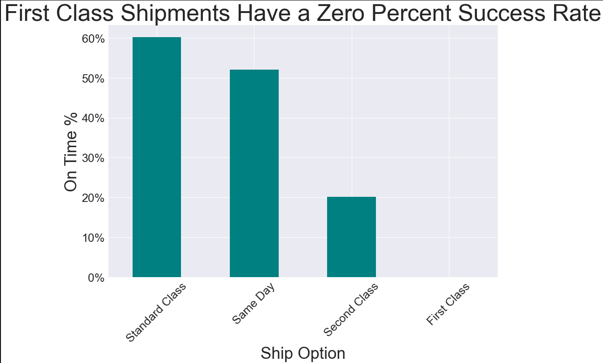
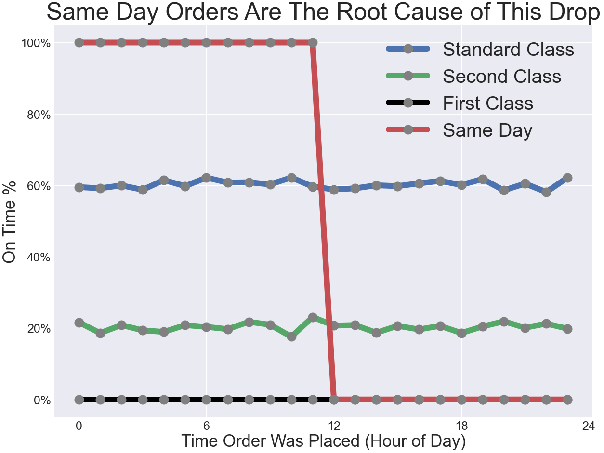

    <h1 align="center"> 🛒 Supply Chain Disruptions 🛒</h1>

  
Table of Contents

  <ol>
<li><a href="#problem-statement">Problem Statement</a></li>
      <li><a href="#executive-summary">Executive Summary</a></li>
    <li><a href="#Data">Data</a></li>
      <li><a href="#getting-started">Getting Started</a></li>
        <li><a href="#prerequisites">Prerequisites</a></li>
        <li><a href="#installation">Installation</a></li>
    <li><a href="#license">License</a></li>
    <li><a href="#contact">Contact</a></li>
    <li><a href="#acknowledgments">Acknowledgments</a></li>
  </ol>

## Problem Statement

Can we accurately predict at the time a customer places an order, whether our warehouse will ship it on time?

 

## Executive Summary

This project involves analyzing supply chain data from ACME Sports in order to identify why the company is only fulfilling 42% of orders by the requested ship date. The data was collected from Kaggle. The data includes 180,000 rows with 60 different features. Features include information pertaining to the products being ordered (price, category, etc), customer information (location, order history, etc) and shipping information (estimated shipping days, ship location, etc). 

Data cleaning largely involved removing columns that were mostly comprised of null values that couldn’t be imputed (‘order zip’ and ‘product description’), or were redundant with other features that were already present. Multiple columns were added to indicate the order hour, month and quarter. An ‘ontime’ column was engineered to indicate whether an order shipped on time based on the estimated and actual ship dates.

As an initial step in EDA we reviewed performance by category to see if certain product types led to higher or lower ship performance. While most categories performed near the 42% average, pet supplies was an outlier at ~38% performance. A review of performance by region indicated that regions with fewer units shipped tended to have worse shipping performance. An analysis of performance over time also indicated that performance would fluctuate between 40% and 45% month over month. By far the largest indicator of performance was the requested ship speed. 
 

Further breaking down ship speed performance by hour of the day that the order was placed revealed that same day performance drops from 100% to 0% for orders that are submitted after 12:00PM. 
 

The model with the highest accuracy was a bagging tree classifier with 19 total features. The model performed with 92.55% accuracy vs. a baseline model of 57%. The most important features were requested ship speed, customer location, order hour of day, whether order was submitted before noon, order week and order profit ratio.

### Process

### Models Used

* Extra Tree Classifier
* Logistic Regression

### Findings
Top performing features:

* Shipping Mode 
* Latitude and Longitude (customer)
* Order Hour of Day
* Order Before Noon
* Order Day of Week, Order Month
* Order Item Profit Ratio, Order Item Discount Rate

### Model Performance

The final model (Extra Tree Classifier) achieved a 92.55% score when predicting whether a product would be shipped on time. This is compared to a baseline model of 57.27%.

 

## Recommendations

* Don’t offer Same Day delivery after midday
* Reallocate freed resources from Same Day to First Class
* Sites with lower ship volume struggle
* Prioritize at-risk shipments

 

### Data

The data was obtained from kaggle and contains 180,000 transactions with 60 different columns about Product, Customer and Order information:

* [Kaggle DataCo Smart Supply Chain for Big Data](https://www.kaggle.com/shashwatwork/dataco-smart-supply-chain-for-big-data-analysis)

A link to the data dictionary can be found [here](https://www.kaggle.com/shashwatwork/dataco-smart-supply-chain-for-big-data-analysis?select=DescriptionDataCoSupplyChain.csv).

 

### Getting Started

No installations are needed to use this project. Please refer to the [requirements.txt](https:) file to see python packages used in this project
## License

Distributed under the MIT License. See `LICENSE.txt` for more information.

<!-- CONTACT -->
## Contributors
[Cynthia Owens](https://www.linkedin.com/in/cynthiakowens/) 
[Chad Richter](https://www.linkedin.com/in/chad-richter/) 
[Sean McNamara](https://www.linkedin.com/in/sean123mcnamara/) 

(<a href="#top">back to top</a>)

